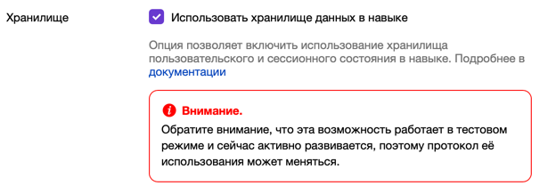

## Машина состояний

> Finite-state machine (FSM) или finite-state automation (FSA), конечный автомат — это математическая модель вычислений.
>
> Это абстрактная машина, которая в любой момент времени может находиться ровно в одном из конечного числа состояний.
> Конечный автомат может переходить из одного состояния в другое в ответ на некоторые входные данные; переход из одного
> состояния в другое называется переходом.
>
> Конечный автомат определяется списком его состояний, его начальным состоянием и входными данными, которые запускают
> каждый переход.
>
> [Википедия](https://en.wikipedia.org/wiki/Finite-state_machine)

### Проблема

Не вся функциональность навыка может быть реализована в одном хэндлере.
Если вам нужно получить некоторую информацию от пользователя в несколько шагов или нужно направить его в зависимости от
ответа, то вам надо использовать FSM.

### Решение

Для начала определите возможные состояния в вашем навыке:

```kotlin
enum class InfoState {
    SET_NAME,
    SET_AGE,
    SET_INFO
}
```

Начальное Состояние  
Когда начинается новая сессия, установите начальное состояние:

```kotlin
newSession {
    state.setState(InfoState.SET_NAME.name)
    response {
        text = "Добро пожаловать в навык, как вас зовут?"
    }
}
```

- `Условие`: Обрабатывается только при начале новой сессии.
- `Действие`: Устанавливает состояние в `SET_NAME` и запрашивает у пользователя имя.

После получения имени от пользователя, сохраняем его и переходим к следующему состоянию:

```kotlin
message({ context.getState() == InfoState.SET_NAME.name }) {
    val username = message.request.originalUtterance.toString()
    state.updateData("name" to username)
    state.setState(InfoState.SET_AGE.name)
    response {
        text = "Рад познакомиться $username, сколько вам лет?"
    }
}
```

- `Условие`: Обрабатывается, если текущее состояние `SET_NAME`.
- `Действие`: Сохраняет имя в состоянии, устанавливает следующее состояние `SET_AGE`, и запрашивает возраст.

После получения возраста от пользователя, сохраняем его и переходим к последнему состоянию:

```kotlin
message({ context.getState() == InfoState.SET_AGE.name }) {
    val age = message.request.originalUtterance.toString()
    state.updateData("age" to age)
    state.setState(InfoState.SET_INFO.name)
    response {
        text = "Супер, расскажите о себе"
    }
}
```

- `Условие`: Обрабатывается, если текущее состояние `SET_AGE`.
- `Действие`: Сохраняет возраст в состоянии, устанавливает следующее состояние `SET_INFO`, и запрашивает дополнительную
  информацию.

На заключительном этапе, после получения дополнительной информации, формируем окончательный ответ и завершаем сессию:

```kotlin
message({ context.getState() == InfoState.SET_INFO.name }) {
    val info = message.request.originalUtterance.toString()
    val data = state.getData()
    state.clear()
    response {
        text = "Вот что мне удалось узнать\n\nИмя-${data["name"]}\nВозраст-${data["age"]}\nИнформация-$info"
        endSession = true
    }
}
```

- `Условие`: Обрабатывается, если текущее состояние `SET_INFO`.
- `Действие`: Формирует текст ответа на основе собранной информации, очищает состояние и завершает сессию.

> ⚠️ **Внимание**  
> Чтобы использовать хранилище на стороне Алисы, включите его в настройках навыка.
>
> 

> ℹ️ **Примечание**  
> Вы можете заменить стандартный `FSMContext` на свою реализацию. По умолчанию
> используется `KotlinxSerializationFSMContext`.
>```kotlin
>skill {
>    fsmContext = { message ->
>        KotlinxSerializationFSMContext(message, fsmStrategy, json)
>    }
>}.run()
> ```

### Заключение

Использование машины состояний позволяет структурировать взаимодействие с пользователем и управлять процессом сбора
информации через последовательные шаги. Это особенно полезно для сложных сценариев, требующих многократного
взаимодействия и сохранения состояния между шагами.

### Примеры

- [Info.kt](../examples/src/main/kotlin/com/github/examples/Info.kt)
- [FsmForm.kt](../examples/src/main/kotlin/com/github/examples/FsmForm.kt)
- [FSMContextTypedData.kt](../examples/src/main/kotlin/com/github/examples/FSMContextTypedData.kt)

### [Кнопки и альбомы ->](Кнопки_и_альбомы.md)