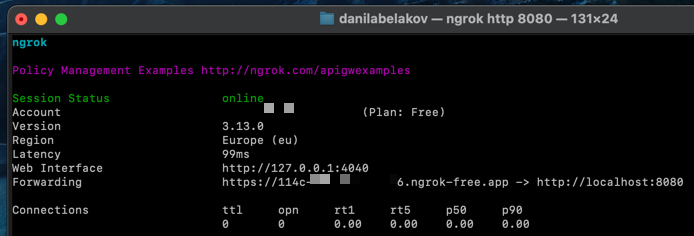
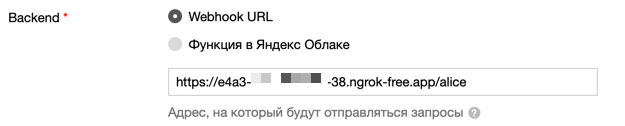

## Начало

Для начала необходимо создать навык в Алисе.

### Создание навыка

1. Зарегистрируйтесь на Яндексе или войдите в свою учетную запись.
2. Перейдите в [панель разработчика](https://dialogs.yandex.ru/developer/).
3. Нажмите на кнопку "Создать диалог".  
  
4. Выберите "Навык в Алисе".  
  
5. Заполните все необходимые поля и в поле Backend выберите Webhook URL.
### Ngrok

Для первого запуска необходимо подключить вебхук к Диалогам. Это можно сделать с помощью ngrok — сервиса, который позволяет сделать локальный порт доступным из интернета без настройки NAT, роутера, DDNS и других протоколов. Программа создает туннель между вашим компьютером и удалённым сервером, предоставляя доступ через уникальный домен.

- [Установите](https://dashboard.ngrok.com/get-started/setup), разархивируйте и запустите ngrok.
- Добавьте ваш [auth-token](https://dashboard.ngrok.com/get-started/your-authtoken) в консоль ngrok.
- Запустите ngrok с командой:
```shell
ngrok http 8080
```
- Через несколько секунд появится длинная ссылка. Укажите её как URL вебхука и добавьте /alice в конце ссылки:

> ⚠️ **Внимание**  
> Не выключайте ngrok, иначе туннель закроется.

- 


6. Сохраните изменения внизу страницы.

### ID навыка
Скоро вам понадобится ID навыка. Его можно найти на вкладке "Общие сведения" в панели разработчика.

> ℹ️ **Примечание**  
> Для запуска в прод вам нужен свой домен и [SSL сертификат](https://wiki.yaboard.com/s/zc), об этом подробнее в [официальной документации](https://yandex.ru/dev/dialogs/alice/doc/deploy-overview.html).

### [Первый навык ->](Первый_навык.md)