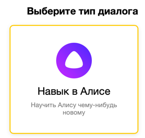

# Создание навыка

Чтобы начать работу с библиотекой **Alice-ktx** и взаимодействовать с примерами работы фреймворка, вам необходимо создать тестовый навык в **Алисе**.

## Шаги для создания навыка

1. **Зарегистрируйтесь или войдите в свою учетную запись на Яндексе**  
   Перейдите на [сайт Яндекса](https://passport.yandex.ru/), чтобы зарегистрироваться или авторизоваться.

2. **Перейдите в панель разработчика**  
   Откройте [панель разработчика Яндекс.Диалогов](https://dialogs.yandex.ru/developer/).

3. **Создайте новый диалог**  
   Нажмите на кнопку **"Создать диалог"**.  
     

4. **Выберите тип диалога**  
   В появившемся окне выберите вариант **"Навык в Алисе"**.  
     

5. **Заполните обязательные поля**  
   Заполните все поля, помеченные звёздочкой, за исключением поля **Backend**.  

6. **Настройка вебхука или облачной функции**  
   Подключите [вебхук](webhook.md) или настройте [облачную функцию](connect-yandex-functions.md) для вашего навыка в зависимости от предпочтений и инфраструктуры.
