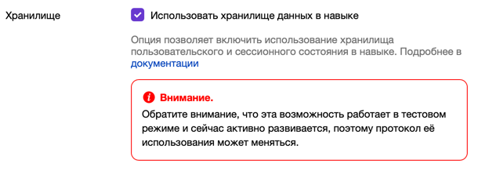

# Машина состояний

!!! info "Теория"
    Finite-state machine (FSM) или finite-state automation (FSA), конечный автомат — это математическая модель вычислений.

    Это абстрактная машина, которая в любой момент времени может находиться ровно в одном из конечного числа состояний.
    Конечный автомат может переходить из одного состояния в другое в ответ на некоторые входные данные; переход из одного
    состояния в другое называется переходом.

    Конечный автомат определяется списком его состояний, его начальным состоянием и входными данными, которые запускают
    каждый переход.

    [Википедия](https://en.wikipedia.org/wiki/Finite-state_machine)

---

## Проблема

Не вся функциональность навыка может быть реализована в одном хэндлере.
Если вам нужно получить некоторую информацию от пользователя в несколько шагов или нужно направить его в зависимости от
ответа, то вам надо использовать FSM.

---

## Решение

### Определение состояний

Для начала определите возможные состояния в вашем навыке:

```kotlin
enum class InfoState {
    SET_NAME,
    SET_AGE,
    SET_INFO
}
```

### Начальное состояние

Когда начинается новая сессия, установите начальное состояние:

```kotlin
newSession {
    context.setState(InfoState.SET_NAME.name)
    response {
        text = "Добро пожаловать в навык, как вас зовут?"
    }
}
```

- **Условие**: Обрабатывается только при начале новой сессии.
- **Действие**: Устанавливает состояние в `SET_NAME` и запрашивает у пользователя имя.

### Переходы между состояниями

#### Состояние `SET_NAME`

После получения имени от пользователя, сохраняем его и переходим к следующему состоянию:

```kotlin
message({ context.getState() == InfoState.SET_NAME.name }) {
    val username = message.request.originalUtterance.toString()
    context.updateData("name" to username)
    context.setState(InfoState.SET_AGE.name)
    response {
        text = "Рад познакомиться $username, сколько вам лет?"
    }
}
```

- **Условие**: Обрабатывается, если текущее состояние `SET_NAME`.
- **Действие**: Сохраняет имя, устанавливает следующее состояние `SET_AGE` и запрашивает возраст.

#### Состояние `SET_AGE`

После получения возраста от пользователя, сохраняем его и переходим к последнему состоянию:

```kotlin
message({ context.getState() == InfoState.SET_AGE.name }) {
    val age = message.request.originalUtterance.toString()
    context.updateData("age" to age)
    context.setState(InfoState.SET_INFO.name)
    response {
        text = "Супер, расскажите о себе"
    }
}
```

- **Условие**: Обрабатывается, если текущее состояние `SET_AGE`.
- **Действие**: Сохраняет возраст, устанавливает следующее состояние `SET_INFO` и запрашивает дополнительную информацию.

#### Состояние `SET_INFO`

На заключительном этапе формируем окончательный ответ и завершаем сессию:

```kotlin
message({ context.getState() == InfoState.SET_INFO.name }) {
    val info = message.request.originalUtterance.toString()
    val data = context.getData()
    context.clear()
    response {
        text = "Вот что мне удалось узнать\\n\\nИмя-${data["name"]}\\nВозраст-${data["age"]}\\nИнформация-$info"
        endSession = true
    }
}
```

- **Условие**: Обрабатывается, если текущее состояние `SET_INFO`.
- **Действие**: Формирует текст ответа, очищает состояние и завершает сессию.

---

## FSMStrategy

Существует несколько стратегий для хранения:

```kotlin
enum class FSMStrategy {
    /**
     * Стратегия управления состоянием на уровне пользователя.
     */
    USER,

    /**
     * Стратегия управления состоянием на уровне сессии.
     */
    SESSION,

    /**
     * Стратегия управления состоянием на уровне приложения.
     */
    APPLICATION
}
```

По умолчанию используется `USER`. Вы можете изменить это следующим образом:

```kotlin
fun main() {
    skill {
        defaultFSMStrategy = FSMStrategy.SESSION
        ...
    }.run()
}
```

---

## FSMContext

FSMContext создается при каждом запросе и предоставляет методы управления состоянием и данными:

### Основные методы

1. `getState(): String?` - Получить текущее состояние.
2. `suspend fun getData()` - Получить все данные.
3. `setState(key: String)` - Установить состояние.
4. `setData(vararg pairs: Pair<String, String>)` - Записать данные.
5. `updateData(vararg pairs: Pair<String, String>)` - Обновить данные.
6. `removeData(key: String)` - Удалить данные.
7. `clear()` - Очистить состояние и данные.

### Пример

```kotlin
skill {
    fsmContext = { message ->
        BaseFSMContext(storage, defaultFSMStrategy, message, skillId)
    }
}
```

---

## Storage

FSMContext использует `Storage` для хранения данных. Поддерживаются следующие реализации:

1. `MemoryStorage` - Хранит данные в оперативной памяти. Используется по умолчанию.
2. `ApiStorage` - Сохраняет данные на стороне Алисы.
3. `RedisStorage` - Использует Redis для хранения данных.

### Пример с MemoryStorage

```kotlin
fun main() {
    skill {
        storage = memoryStorage()
    }.run()
}
```

!!! danger "Важно"
    Не рекомендуется для использования в продакшн-окружении, так как данные теряются при каждом перезапуске навыка.

---

### Пример с ApiStorage

```kotlin
fun main() {
    skill {
        storage = apiStorage()
    }.run()
}
```

!!! warning "Важно"
    Чтобы использовать хранилище на стороне Алисы (ApiStorage), включите в настройках навыка.
    


---

### Пример с RedisStorage

```kotlin
fun main() {
    skill {
        storage = redisStorage {
            redis = connectToRedis(host = "localhost")
        }
    }.run()
}
```

---

!!! note "Примечание"
    Если навыком пользуется неавторизованный пользователь, то стратегия `FSMStrategy.USER` будет работать как `FSMStrategy.APPLICATION`:
    
    - **Для локальных хранилищ**: `userId` будет равен `applicationId`.  
    - **Для хранилища на стороне Алисы**: состояние будет сохраняться на уровне устройства.


## Примеры

- [Info.kt](https://github.com/danbeldev/alice-ktx/blob/master/examples/src/main/kotlin/com/github/examples/Info.kt)
- [FsmForm.kt](https://github.com/danbeldev/alice-ktx/blob/master/examples/src/main/kotlin/com/github/examples/FsmForm.kt)
- [FSMContextTypedData.kt](https://github.com/danbeldev/alice-ktx/blob/master/examples/src/main/kotlin/com/github/examples/FSMContextTypedData.kt)
