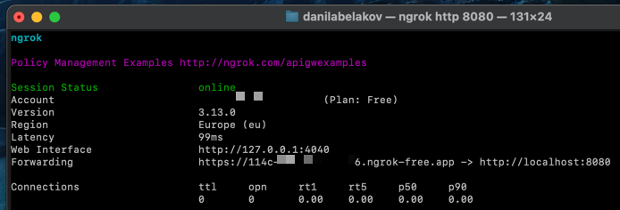
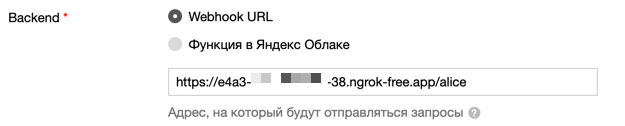

# Подключение локального вебхука

## Ngrok

Для первого запуска необходимо подключить вебхук к Диалогам. Это можно сделать с помощью ngrok — сервиса, который позволяет сделать локальный порт доступным из интернета без настройки NAT, роутера, DDNS и других протоколов. Программа создает туннель между вашим компьютером и удалённым сервером, предоставляя доступ через уникальный домен.

1. [Установите](https://dashboard.ngrok.com/get-started/setup), разархивируйте и запустите ngrok.
2. Добавьте ваш [auth-token](https://dashboard.ngrok.com/get-started/your-authtoken) в консоль ngrok.
3. Запустите ngrok с командой:
    ```shell
    ngrok http 8080
    ```
4. Через несколько секунд появится длинная ссылка. Укажите её как URL вебхука и добавьте `/alice` в конце ссылки:

    !!! warning "Важно"
        Не выключайте ngrok, иначе туннель закроется.

    
    

5. Сохраните изменения.

!!! info "Примечание"
    Для запуска в прод вам нужен свой домен и [SSL сертификат](https://wiki.yaboard.com/s/zc), об этом подробнее в [официальной документации](https://yandex.ru/dev/dialogs/alice/doc/deploy-overview.html).
